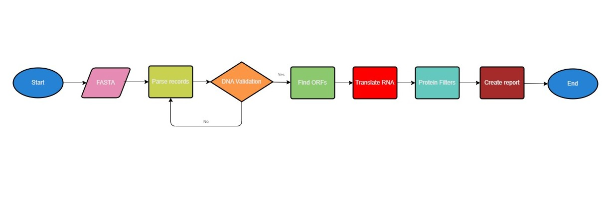
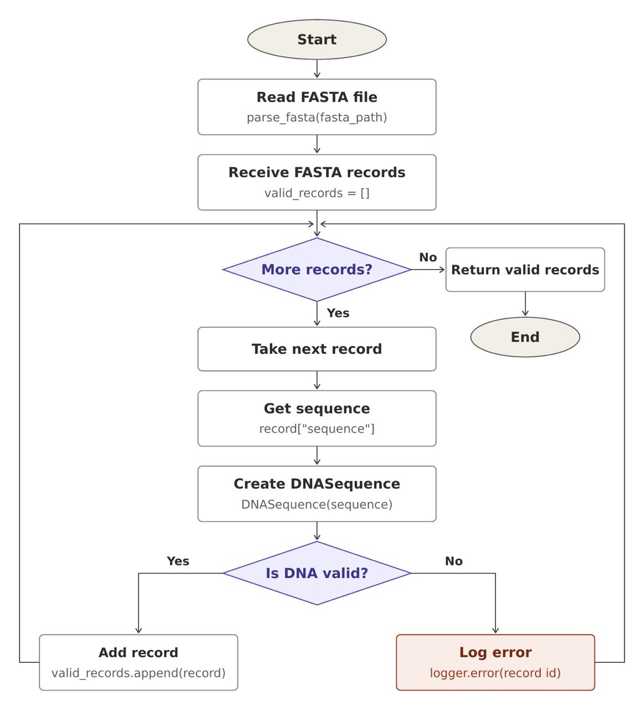
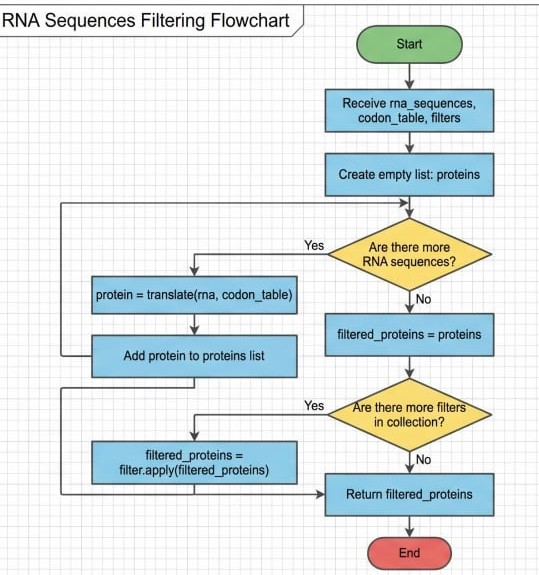

<div align="center">

# 🧬 BioForge

### A simple command-line pipeline for DNA sequence analysis

BioForge reads DNA sequences, finds open reading frames, translates them into proteins, filters the results, and creates a clear report.

</div>

---

## Table of Contents

- [Project Overview](#-project-overview)
- [Pipeline Flow](#-pipeline-flow)
- [Team Flowcharts](#-team-flowcharts)
- [Usage](#-usage)
- [FASTA Input and Data Files](#-fasta-input-and-data-files)
- [DNA Processing and ORF Detection](#-dna-processing-and-orf-detection)
- [Translation and Protein Processing](#-translation-and-protein-processing)
- [Output Files](#-output-files)
- [Project Structure](#-project-structure)
- [Team Members](#-team-members)

## Project Overview

BioForge is a Python command-line pipeline for processing and analyzing DNA sequences.

The program reads DNA records from a FASTA file, validates each sequence, searches for **Open Reading Frames (ORFs)** on both DNA strands, translates the detected ORFs into proteins, calculates protein molecular weights, applies filters, and generates output reports.

This project was developed as a Python programming bootcamp mini-project. It demonstrates:

- File handling
- Object-oriented programming
- Custom exceptions
- Logging
- Biological sequence processing
- Command-line argument parsing

## Main Features

| Feature | Description |
|---|---|
| Multi-record FASTA | Reads and processes more than one DNA record |
| DNA validation | Accepts only `A`, `T`, `C`, and `G` |
| Six reading frames | Checks three forward and three reverse frames |
| ORF detection | Keeps both complete and incomplete ORFs |
| RNA translation | Converts RNA codons into amino acids |
| Protein filters | Filters proteins by length and molecular weight |
| Reports and logs | Creates separate timestamped files for every run |

## Pipeline Flow

The complete pipeline connects all project sections in this order:



## Team Flowcharts

### Shamin and Mobina — FASTA and DNA Processing



### Davood and Marzieh — Translation and Protein Processing



## Usage

Run BioForge from the project root:

```bash
python main.py \
  --input samples/example.fasta \
  --out output \
  --min-length 4 \
  --min-weight 500
```

All four arguments are required:

| Argument | Description | Example |
|---|---|---|
| `--input` | Path to the input FASTA file | `samples/example.fasta` |
| `--out` | Path to the output directory | `output` |
| `--min-length` | Minimum accepted protein length | `4` |
| `--min-weight` | Minimum accepted protein molecular weight | `500` |

BioForge processes every FASTA record and writes the final report and log into the selected output directory.

## FASTA Input and Data Files

### FASTA Input

BioForge accepts a multi-record FASTA file. Each record starts with a header beginning with `>`.

```text
>seq001 organism=E_coli sample=A
ATGCTTTCATAG

>seq002 organism=Human sample=B
cccatggggtaa
```

For each record, BioForge extracts:

- ID
- Description
- DNA sequence
- Organism, when available

Empty lines are ignored. Lowercase DNA is accepted and converted to uppercase. A FASTA file is invalid when sequence data appears before the first header, a header has no sequence, or the file contains no records. Duplicate IDs are accepted but produce a warning in the log.

### Data Files

The biological values are loaded at runtime and are not hardcoded in the Python files.

| File | Content |
|---|---|
| `data/codon_table.txt` | RNA codons and their amino acid codes |
| `data/amino_weights.txt` | Amino acid codes and their molecular weights |

Example codon data:

```text
AUG M
UUU F
UAA *
```

Example amino acid weight data:

```text
A 71.037
C 103.009
M 131.040
```

Empty lines and lines beginning with `#` are ignored. A missing file, empty file, or malformed line raises `DataFileError` and writes the error to the log.

## 🧬 DNA Processing and ORF Detection

### DNA Operations

Each DNA sequence is converted to uppercase and checked one character at a time. Only `A`, `T`, `C`, and `G` are valid.

BioForge can then:

- Create the complementary DNA strand
- Create the reverse-complement DNA strand
- Convert DNA to RNA by replacing `T` with `U`
- Calculate GC content

Example:

```text
DNA:                ATGC
RNA:                AUGC
Complement:         TACG
Reverse complement: GCAT
```

### ORF Detection

An **Open Reading Frame (ORF)** is a part of an RNA sequence that may be translated into a protein. BioForge searches all six reading frames: three on the original strand and three on the reverse-complement strand.

An ORF begins with `AUG` and ends at the first in-frame stop codon:

```text
UAA    UAG    UGA
```

The sequence is always checked three characters at a time. Therefore, a stop codon is accepted only when it is in the same reading frame as the start codon.

```text
RNA:     CCCAUGGCUUAA
Codons:  CCC | AUG | GCU | UAA
ORF:           AUG | GCU | UAA
Protein:       M     A
```

A complete ORF ends with a valid stop codon. An incomplete ORF has no in-frame stop codon but is still kept until the RNA sequence ends.

Each `ORF` object stores:

| Field | Meaning |
|---|---|
| `rna` | Detected RNA sequence |
| `protein` | Translated protein sequence |
| `strand` | `Forward` or `Reverse` |
| `frame` | Reading frame `0`, `1`, or `2` |
| `start_pos` | Zero-based position in the original DNA |
| `is_complete` | Whether an in-frame stop codon was found |

## Translation and Protein Processing

### RNA Translation

Each ORF is read three characters at a time. Every codon is looked up in `data/codon_table.txt`, and its amino acid is added to the protein sequence.

```text
RNA:      AUG | CUU | UCA | UAG
Amino:     M     L     S    Stop
Protein:   MLS
```

Translation stops at `UAA`, `UAG`, or `UGA`. The stop codon is not included in the protein. For an incomplete ORF, all available complete codons are translated.

### Molecular Weight

The weight of every amino acid is loaded from `data/amino_weights.txt`. The total molecular weight is the sum of all amino acid weights in the protein.

```text
Protein: MA
Weight:  weight(M) + weight(A)
```

### Protein Filters

Filters are applied after translation:

1. `LengthFilter` keeps proteins whose length is greater than or equal to `--min-length`.
2. `WeightFilter` keeps proteins whose total weight is greater than or equal to `--min-weight`.

Only proteins that pass both filters are included in the final report.

## Output Files

BioForge creates a separate report and log for every run. Both filenames contain the same timestamp, so related files are easy to identify and previous results are not overwritten.

```text
output/
├── report_20261005_213000_123456.txt
└── bioforge_20261005_213000_123456.log
```

The report contains the final ORF information:

```text
ID: BFG_001
Strand: Forward
Frame: 0
Start Position: 0
Protein: MA
Status: Complete
```

The log records problems such as invalid DNA sequences, duplicate FASTA IDs, missing data files, and malformed data-file lines.

## Project Structure

```text
BioForge/
├── bioforge/
│   ├── errors.py
│   ├── pipeline.py
│   ├── files/
│   │   ├── data_loader.py
│   │   ├── fasta.py
│   │   ├── logger.py
│   │   └── reporting.py
│   ├── orf/
│   │   ├── models.py
│   │   └── orf_detector.py
│   ├── protein/
│   │   ├── calculate_weight.py
│   │   ├── processing.py
│   │   └── protein_filters.py
│   └── sequences/
│       ├── dna.py
│       └── translation.py
├── data/
│   ├── amino_weights.txt
│   └── codon_table.txt
├── samples/
│   └── example.fasta
├── main.py
└── README.md
```

| Section | Responsibility |
|---|---|
| `bioforge/files` | FASTA parsing, data loading, logging, and reports |
| `bioforge/sequences` | DNA operations and RNA translation |
| `bioforge/orf` | ORF model and ORF detection |
| `bioforge/protein` | Protein weight calculation and filters |
| `bioforge/pipeline.py` | Connects all processing stages |
| `main.py` | Command-line entry point |

## Team Members

| Member | Responsibility |
|---|---|
| **Hadi** | ORF Detection and Pipeline Integration |
| **Shamin** | FASTA Parsing and Logging |
| **Mobina** | Data File Loading and DNA Sequence Operations |
| **Davood** | RNA Translation and Command-Line Interface |
| **Marzieh** | Protein Analysis and Protein Filters |

---
